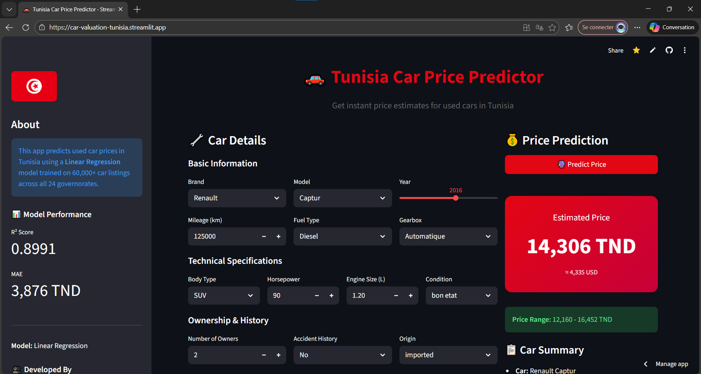
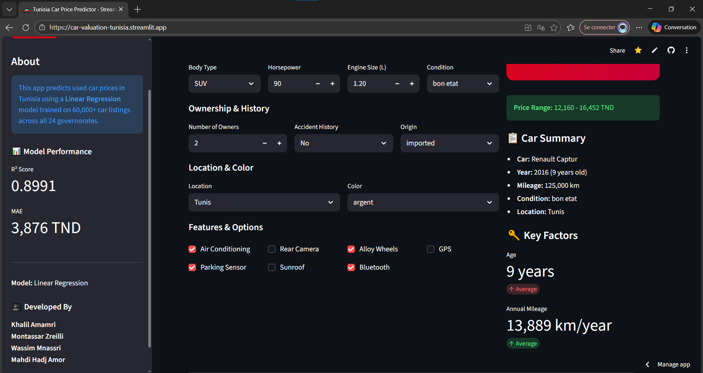

<div align="center">

# 🚗 Tunisia Car Price Predictor

Estimate used car prices in Tunisia using a Multiple Linear Regression model trained on 60,000+ synthetic listings (23 brands, 89% accuracy). Interactive Streamlit app with real-time predictions.

**Live App:** https://car-valuation-tunisia.streamlit.app/

</div>

---

## 📌 Quick Navigation

- [Overview](#overview)
- [Key Features](#key-features)
- [Live Application Preview](#-live-application-preview)
- [Project Structure](#project-structure)
- [Quick Start](#quick-start)
- [How to Use](#how-to-use)
- [Disclaimer](#disclaimer)

---

## Overview

This project provides a transparent, end-to-end machine learning workflow to estimate used car prices in Tunisia. It includes:

- **Synthetic Dataset Generator**: Reflects real market dynamics (brand, condition, fuel type, mileage, location, etc.)
- **ML Pipeline**: Data loading → Cleaning → Feature engineering → Linear Regression training → Evaluation
- **Interactive Web App**: Streamlit interface with real-time predictions and model insights

**Goal**: Demonstrate a complete ML lifecycle (from data generation to deployment) for educational purposes.

---

## Key Features

- ✅ **Accuracy**: R² = 89.91% | MAE = 3,876 TND
- 🎯 **Real-time Predictions**: Instant price estimates via Streamlit UI
- 🔧 **Smart Encoding**: Dynamic categorical features aligned between training and inference
- 📊 **Model Transparency**: View top coefficients and feature weights
- 💾 **Reproducible**: Full notebook-based pipeline with versioned artifacts
- 🧪 **60,000+ Dataset**: Synthetic but realistic car listings

---

## 🌟 Live Application Preview

> **Try it live:** https://car-valuation-tunisia.streamlit.app/

### App Interface - Input Form & Configuration



**Features:**

- 📝 **Easy Input Form**: Select car brand, model, year, mileage, and specifications
- 🎯 **Real-time Calculations**: Instant updates as you adjust values
- 📊 **Model Metrics**: View R² = 0.8991 and MAE = 3,876 TND in sidebar
- 🚗 **Complete Car Specifications**: Brand, model, fuel, gearbox, condition, body type, horsepower, engine size

### App Interface - Prediction Results & Insights



**Results Display:**

- 💰 **Instant Price Prediction**: Get estimated price in seconds
- 📊 **Price Confidence Range**: ±15% range for realistic valuation
- 📋 **Car Summary**: See key details about the selected vehicle
- 🔑 **Key Factors**: Age and annual mileage analysis with trend indicators
- 👥 **Team Information**: View developed by section with team member names

---

## Project Structure

```
Car_Valuation_Tunisia/
├── app/
│   ├── Predict_Price.py                    # Main prediction page
│   └── pages/
│       ├── Market_Insights.py              # Market dashboard
│       └── About_Model.py                  # Model documentation
├── data/raw/tunisia_cars_dataset.csv       # Generated dataset
├── models/linear_regression_tunisia_cars.pkl  # Trained model
├── notebooks/Tunisia_Cars_Price_Prediction.ipynb  # Training pipeline
├── scripts/script_to_generate_dataset.ipynb     # Dataset generation
├── requirements.txt                        # Dependencies
└── README.md
```

---

## Quick Start

### 1. Setup Environment

```pwsh
# Clone repository
git clone https://github.com/KhalilAmamri/Car_Valuation_Tunisia.git
cd Car_Valuation_Tunisia

# Create virtual environment
python -m venv .venv
./.venv/Scripts/Activate.ps1

# Install dependencies
pip install -r requirements.txt
```

### 2. Launch App Locally

```pwsh
streamlit run app/Predict_Price.py
```

The app includes **3 pages** accessible via sidebar:

- **Predict Price**: Interactive car price prediction
- **Market Insights**: Dashboard with market visualizations
- **About Model**: Model explanation and metrics

Or visit the **live app**: https://car-valuation-tunisia.streamlit.app/

---

## How to Use

### Option A: Use the Web App (Recommended)

1. Visit https://car-valuation-tunisia.streamlit.app/
2. Navigate between pages:
   - **Predict Price**: Enter car specs and get price estimates
   - **Market Insights**: Explore market trends
   - **About Model**: Learn how the model works

### Option B: Regenerate Dataset & Train Model

1. Run `scripts/script_to_generate_dataset.ipynb` → All cells
2. Run `notebooks/Tunisia_Cars_Price_Prediction.ipynb` → Sections 1-7
3. Model saved to `models/linear_regression_tunisia_cars.pkl`

### Option C: Run Locally

```pwsh
streamlit run app/Predict_Price.py
```

Visit `http://localhost:8501`

---

## Model Details

- **Algorithm**: Multiple Linear Regression (scikit-learn)
- **Features**: Age, mileage/year, brand, model, fuel type, gearbox, condition, body type, location, color
- **Performance**: R² = 0.8991 | MAE = 3,876 TND
- **Encoding**: One-hot encoding (drop_first=True) with StandardScaler for numeric features

---

## Disclaimer

⚠️ **This dataset is entirely synthetic and for educational purposes only.** Predictions do NOT represent official market valuations. Always consult real market data and professional sources for financial decisions.

---

## 🙌 Team

Khalil Amamri | Montassar Zreilli | Wassim Mnassri | Mahdi Hadj Amor

Enjoy exploring Tunisian car valuation! 🚗🇹🇳
