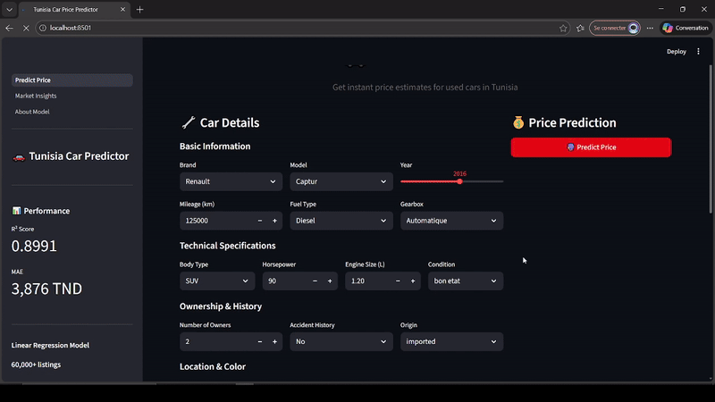

<div align="center">

# 🚗 Tunisia Car Price Predictor

Estimate used car prices in Tunisia using Machine Learning. Interactive Streamlit app with real-time predictions and market insights.

**Live App:** https://car-valuation-tunisia.streamlit.app/

</div>

---

## ✨ Key Features

- ✅ **High Accuracy**: R² = 89.91% | MAE = 3,876 TND
- 🎯 **3-Page Interactive App**: Predict Price • Market Insights • About Model
- 💰 **Real-time Predictions**: Instant price estimates
- 📊 **Market Dashboard**: 4 interactive charts showing pricing trends
- 📦 **60,000+ Dataset**: Synthetic but realistic car listings
- 🤖 **Linear Regression Model**: scikit-learn with feature transparency

---

## 🎬 Demo Video

<div align="center">

**Watch the app in action:**



</div>

---

## 🚀 Quick Start

### Online (Easiest)

Visit: https://car-valuation-tunisia.streamlit.app/

### Local Setup

```pwsh
# Clone & setup
git clone https://github.com/KhalilAmamri/Car_Valuation_Tunisia.git
cd Car_Valuation_Tunisia

# Create environment
python -m venv .venv
./.venv/Scripts/Activate.ps1

# Install & run
pip install -r requirements.txt
streamlit run app/Predict_Price.py
```

Then open http://localhost:8501

---

## 📁 Project Structure

```
Car_Valuation_Tunisia/
├── app/
│   ├── Predict_Price.py           # Main page - Price prediction
│   └── pages/
│       ├── 1_Market_Insights.py   # Dashboard with 4 charts
│       └── 2_About_Model.py       # Model documentation
├── data/raw/
│   └── tunisia_cars_dataset.csv   # 60,000+ listings
├── models/
│   └── linear_regression_tunisia_cars.pkl
├── notebooks/
│   └── Tunisia_Cars_Price_Prediction.ipynb
├── requirements.txt
└── README.md
```

---

## 📖 How to Use

### 1. Predict Price

- Enter car details (brand, year, mileage, etc.)
- Click "Predict Price"
- Get instant estimate with confidence range

### 2. Market Insights

- **Chart 1**: Price distribution by category
- **Chart 2**: Depreciation trends (year vs price)
- **Chart 3**: Market price distribution
- **Chart 4**: Top features affecting price

### 3. About Model

- Model performance metrics
- Algorithm explanation
- Features used
- Training process details

---

## 🛠️ Technical Stack

- **Language**: Python 3.10+
- **ML**: scikit-learn (Linear Regression)
- **Web**: Streamlit
- **Visualization**: Plotly
- **Data**: pandas, numpy

---

## ⚠️ Disclaimer

This is an **educational project** using **synthetic data**. Predictions are NOT official market valuations. Always consult real market data for financial decisions.

---

## 🙌 Team

Khalil Amamri | Montassar Zreilli | Wassim Mnassri | Mahdi Hadj Amor

🚗 **Enjoy exploring Tunisian car valuation!** 🇹🇳
